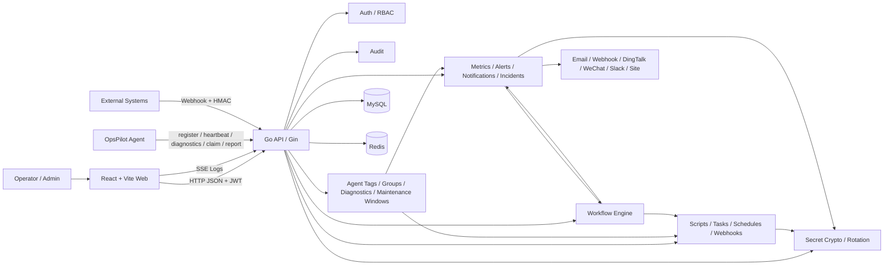
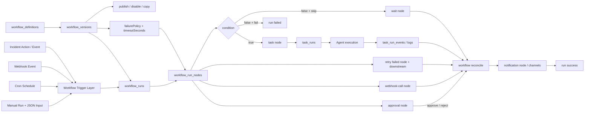
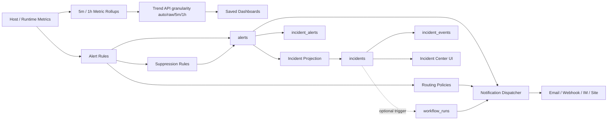
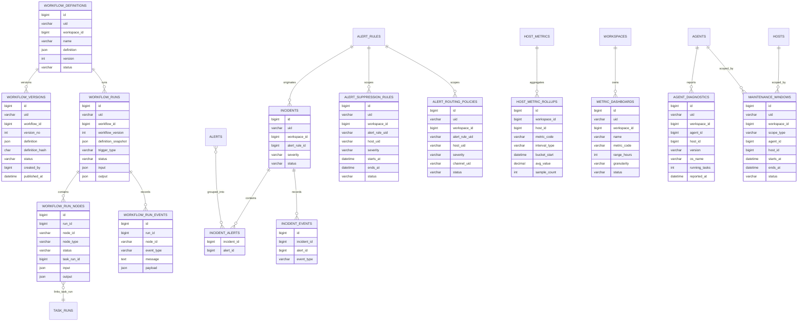
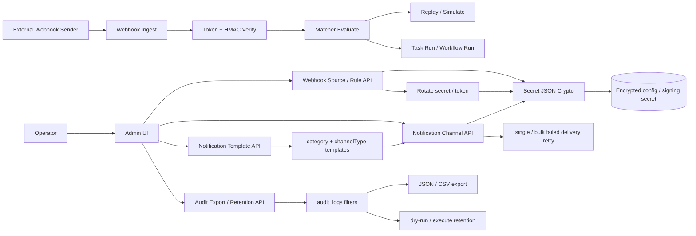

# OpsPilot UML Update Notes (V1.0)

> Language: English (current) | [Chinese](./core-uml-v1.0-update.md)

Generated: 2026-05-08

## 1. Purpose

This document supplements and corrects the following UML baselines:

- The original UML in `docs/OpsPilot_技术与开发方案_V2.docx`
- The repository UML baseline in `docs/UML/core-uml.md`

The conclusion is straightforward: once `Incident`, `Workflow`, and their related backend/frontend modules were implemented, the older UML stopped reflecting the actual system. The biggest gaps are in orchestration flow, alert-to-incident operations, and the new database entities. This file provides a versioned UML supplement for the current `OpsPilot V1.0` implementation snapshot.

## 2. Version Mapping

| Baseline | File | Software version | Notes |
| --- | --- | --- | --- |
| Original UML baseline | `docs/OpsPilot_技术与开发方案_V2.docx` | Early V2 design draft | Captures early task scheduling and alerting concepts, but does not include implemented `Workflow` and `Incident` models |
| Repository UML baseline | `docs/UML/core-uml.md` | Generic core UML baseline | Good for broad system overview, but not a versioned update for the recent implementation changes |
| Updated UML in this document | `docs/UML/core-uml-v1.0-update.en.md` | `OpsPilot V1.0` current implementation snapshot (2026-05-08) | Covers the parts that changed and now need revised diagrams |

## 3. Why the Old UML Needs an Update

The old diagrams no longer cover these changes:

1. A new `Workflow` module now exists, including definition, independent versions, publish, disable, copy, manual runs with input, nodes, events, cancel, whole-run retry, node-level retry, node timeout, failure policies, approval node handling, and DAG progression behavior.
2. A new `Incident` module now exists, so alert handling is no longer only `alert`-level state.
3. The trigger chain has expanded from "mainly trigger a Task" to "Manual / Schedule / Webhook / Incident can drive a Workflow"; Webhook also has matcher simulation and event replay.
4. The frontend information architecture now includes `Workflows` and `Incidents`.
5. Secret, Webhook, Notification, and Audit governance have been hardened with encrypted config, secret rotation, audit export, and retention runs.
6. The database now includes or extends `000005_v10_incidents`, `000006_v10_workflows`, `000008_v10_secret_audit_webhook_hardening`, and `000009_v10_workflow_versions`, which are missing from the older model diagrams.

## 4. Updated Diagram 1: V1.0 System Context

Applies to: `OpsPilot V1.0`

What changed:

- `Workflow Engine` and `Incidents` are now first-class modules in the system context.
- `Workflow` now interacts with tasks, notifications, webhooks, and incidents instead of the platform being only task-centric.
- Secret encryption and rotation are now shared governance capabilities for webhook sources, notification channels, and similar sensitive configuration.
- Agent management now includes tags/groups, diagnostic snapshots, version inventory, and maintenance windows as the Fleet operations baseline; maintenance windows now suppress alert notifications and skip schedule firing.

## 5. Updated Diagram 2: V1.0 Trigger and Orchestration Flow

Applies to: `OpsPilot V1.0`

What changed:

- The older model was mostly `Schedule/Webhook -> Task`.
- The current model is `Trigger -> Workflow -> Node -> Task/Wait/Condition`, which matches the current implementation direction.
- The diagram now includes `workflow_versions`, manual JSON input, approval handling, and webhook-call nodes. Runs still store a definition snapshot so historical runs are not affected by later definition edits.
- The runtime now scans `timeoutSeconds` and fails timed-out nodes; `failurePolicy` supports `stop_on_failure`, `stop_workflow`, `skip_downstream`, and `continue`.
- Node-level retry resets the target failed/canceled node and its downstream nodes, then resumes the same workflow run.

## 6. Updated Diagram 3: V1.0 Alert-to-Incident Operations Flow

Applies to: `OpsPilot V1.0`

What changed:

- The original UML mostly stopped at `alert + notification`.
- The current implementation already has `incidents / incident_alerts / incident_events`, so the operational model must include them.
- The current implementation adds `alert_suppression_rules` and `alert_routing_policies`; alert firing can suppress or route notifications by rule, host, and severity.
- Metrics lifecycle now includes `host_metric_rollups`, saved dashboards, and retention runs. Trend queries can select `auto/raw/5m/1h` data granularity.

## 7. Updated Diagram 4: V1.0 Data Model Delta

Applies to: `OpsPilot V1.0`

What changed:

- This diagram only captures the delta relative to the older model.
- `workflow_definitions / workflow_runs / workflow_run_nodes / workflow_run_events` come from `000006_v10_workflows.up.sql`.
- `workflow_versions` comes from `000009_v10_workflow_versions.up.sql`.
- `incidents / incident_alerts / incident_events` comes from `000005_v10_incidents.up.sql`.
- `host_metric_rollups / metric_dashboards` come from `000011_v10_metrics_lifecycle.up.sql`.
- `alert_suppression_rules / alert_routing_policies` come from `000012_v10_alert_routing_suppression.up.sql`.
- `tags / resource_tags / host_groups / host_group_members` are Fleet organization tables from the initial schema; this round adds API/UI coverage.
- `agent_diagnostics / maintenance_windows` come from `000013_v10_agent_fleet_operations.up.sql`.

## 8. Updated Diagram 5: V1.0 Secret, Webhook, and Audit Governance Flow

Applies to: `OpsPilot V1.0`

What changed:

- Webhook source signing secrets and notification channel sensitive config now go through shared encrypted secret handling.
- Webhook operations now include matcher simulation, event replay, and secret/token rotation.
- Notification operations now include template / channel-specific template rendering, plus single and bulk failed-delivery retry.
- Audit now includes advanced filters, export, and retention runs as V1.0 release governance behavior.

## 9. Recommended Baseline Strategy

Do not overwrite `docs/UML/core-uml.md` directly yet:

1. `docs/UML/core-uml.md` still works as the general system-wide UML baseline.
2. This file is better positioned as a versioned change supplement.
3. If the project later wants one single canonical UML file for release, merge these five diagrams back into `docs/UML/core-uml.md` and add the version marker there.

## 10. Conclusion

Based on the current implementation, at least these older UML areas should be treated as outdated or in need of versioned supplements:

- System context
- Task/schedule/webhook trigger flow
- Alert and notification flow
- Database delta model
- Secret, Webhook operations, and Audit governance flow

This document is the revised `OpsPilot V1.0` UML supplement for those parts.
