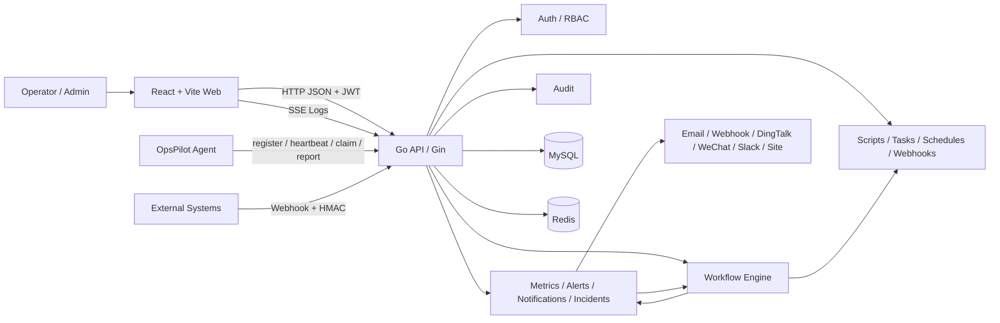
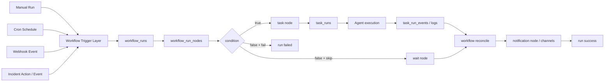
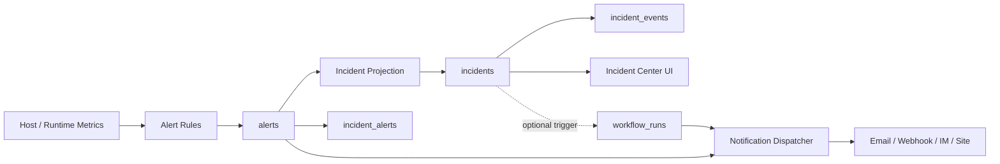
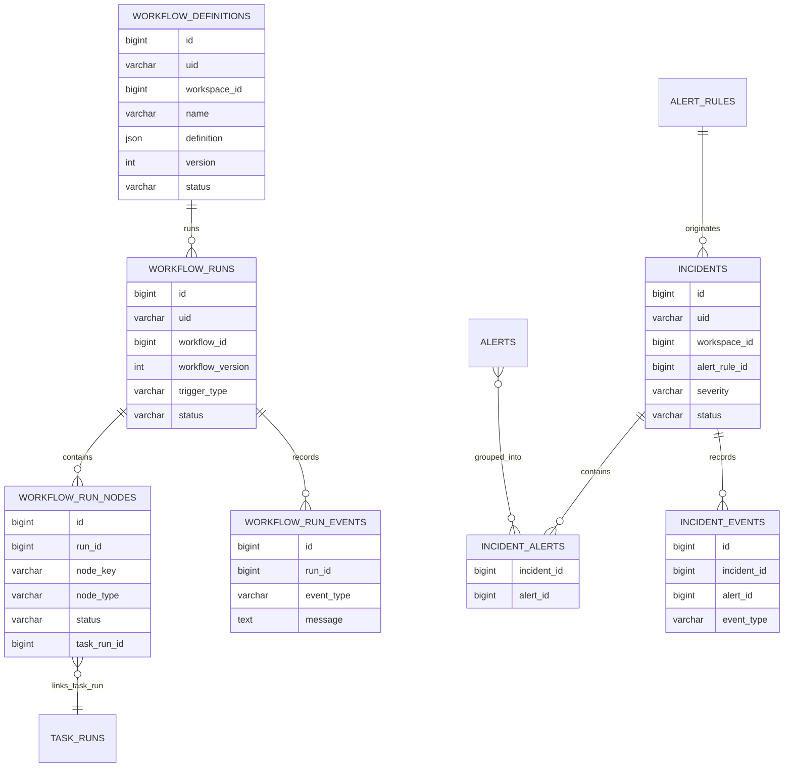

# OpsPilot UML Update Notes (V1.0)

> Language: English (current) | [Chinese](./core-uml-v1.0-update.md)

Generated: 2026-05-08

## 1. Purpose

This document supplements and corrects the following UML baselines:

- The original UML in `docs/OpsPilot_技术与开发方案_V2.docx`
- The repository UML baseline in `docs/core-uml.md`

The conclusion is straightforward: once `Incident`, `Workflow`, and their related backend/frontend modules were implemented, the older UML stopped reflecting the actual system. The biggest gaps are in orchestration flow, alert-to-incident operations, and the new database entities. This file provides a versioned UML supplement for the current `OpsPilot V1.0` implementation snapshot.

## 2. Version Mapping

| Baseline | File | Software version | Notes |
| --- | --- | --- | --- |
| Original UML baseline | `docs/OpsPilot_技术与开发方案_V2.docx` | Early V2 design draft | Captures early task scheduling and alerting concepts, but does not include implemented `Workflow` and `Incident` models |
| Repository UML baseline | `docs/core-uml.md` | Generic core UML baseline | Good for broad system overview, but not a versioned update for the recent implementation changes |
| Updated UML in this document | `docs/core-uml-v1.0-update.en.md` | `OpsPilot V1.0` current implementation snapshot (2026-05-08) | Covers the parts that changed and now need revised diagrams |

## 3. Why the Old UML Needs an Update

The old diagrams no longer cover these changes:

1. A new `Workflow` module now exists, including definition, publish, run, node, event, cancel, and DAG progression behavior.
2. A new `Incident` module now exists, so alert handling is no longer only `alert`-level state.
3. The trigger chain has expanded from "mainly trigger a Task" to "Manual / Schedule / Webhook / Incident can drive a Workflow".
4. The frontend information architecture now includes `Workflows` and `Incidents`.
5. The database now includes `000005_v10_incidents` and `000006_v10_workflows`, which are missing from the older model diagrams.

## 4. Updated Diagram 1: V1.0 System Context

Applies to: `OpsPilot V1.0`

What changed:

- `Workflow Engine` and `Incidents` are now first-class modules in the system context.
- `Workflow` now interacts with tasks, notifications, and incidents instead of the platform being only task-centric.

## 5. Updated Diagram 2: V1.0 Trigger and Orchestration Flow

Applies to: `OpsPilot V1.0`

What changed:

- The older model was mostly `Schedule/Webhook -> Task`.
- The current model is `Trigger -> Workflow -> Node -> Task/Wait/Condition`, which matches the current implementation direction.

## 6. Updated Diagram 3: V1.0 Alert-to-Incident Operations Flow

Applies to: `OpsPilot V1.0`

What changed:

- The original UML mostly stopped at `alert + notification`.
- The current implementation already has `incidents / incident_alerts / incident_events`, so the operational model must include them.

## 7. Updated Diagram 4: V1.0 Data Model Delta

Applies to: `OpsPilot V1.0`

What changed:

- This diagram only captures the delta relative to the older model.
- `workflow_*` comes from `000006_v10_workflows.up.sql`.
- `incidents / incident_alerts / incident_events` comes from `000005_v10_incidents.up.sql`.

## 8. Recommended Baseline Strategy

Do not overwrite `docs/core-uml.md` directly yet:

1. `docs/core-uml.md` still works as the general system-wide UML baseline.
2. This file is better positioned as a versioned change supplement.
3. If the project later wants one single canonical UML file for release, merge these four diagrams back into `docs/core-uml.md` and add the version marker there.

## 9. Conclusion

Based on the current implementation, at least these older UML areas should be treated as outdated or in need of versioned supplements:

- System context
- Task/schedule/webhook trigger flow
- Alert and notification flow
- Database delta model

This document is the revised `OpsPilot V1.0` UML supplement for those parts.
