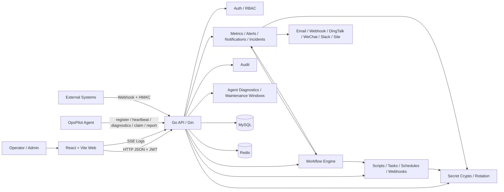
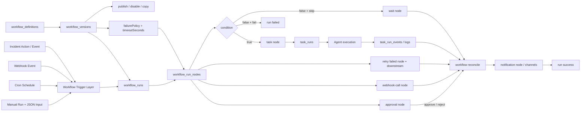
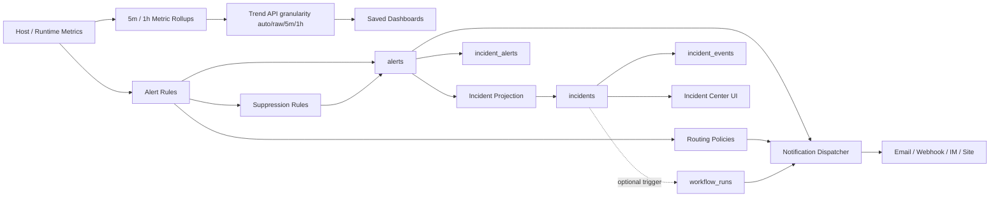
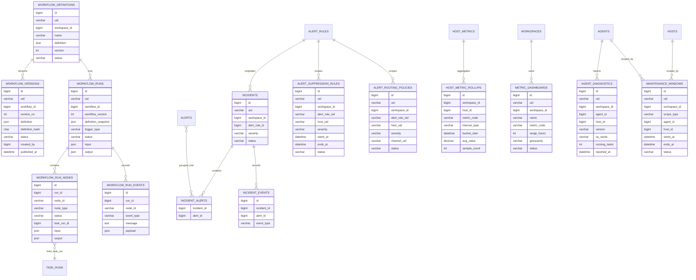
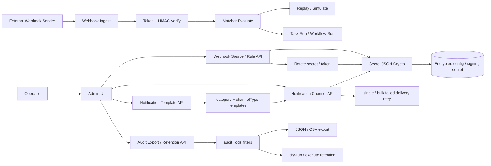

# OpsPilot UML 更新说明（V1.0）

> Language: 简体中文（当前） | [English](./core-uml-v1.0-update.en.md)

生成日期：2026-05-08

## 1. 目的

本文用于补充和修正以下两份 UML 基线：

- 原始方案文档中的 UML：`docs/OpsPilot_技术与开发方案_V2.docx`
- 当前仓库中的 UML 基线：`docs/UML/core-uml.md`

结论很明确：随着 `Incident`、`Workflow` 以及相关前后端模块落地，原有 UML 已不能完整表达当前实现，尤其是自动化编排链路、事件化告警链路和新增数据模型。因此，本文件给出一组新的版本化 UML 图，作为 `OpsPilot V1.0` 当前实现快照的补充基线。

## 2. 版本对应关系

| 基线 | 文件 | 对应版本 | 说明 |
| --- | --- | --- | --- |
| 原始 UML 基线 | `docs/OpsPilot_技术与开发方案_V2.docx` | 早期 V2 方案草案 | 反映的是早期任务调度/告警能力，不包含 `Workflow` 与 `Incident` 落地模型 |
| 仓库 UML 基线 | `docs/UML/core-uml.md` | 通用核心 UML 基线 | 适合作为总览，但未显式按本轮实现变更给出版本化修订说明 |
| 本次更新 UML | `docs/UML/core-uml-v1.0-update.md` | `OpsPilot V1.0` 当前实现快照（2026-05-08） | 用于覆盖本轮新增或已发生结构变化的图 |

## 3. 为什么原图需要更新

以下变化已经超出旧图表达范围：

1. 新增 `Workflow` 模块，已包含定义、独立版本、发布、禁用、复制、手动输入运行、节点、事件、取消、整 run 重试、节点级重试、节点超时、失败策略、审批节点处理、DAG 推进等后端能力。
2. 新增 `Incident` 模块，告警不再只停留在 `alert` 层，而是形成 `incident + incident_events` 的运营视角。
3. 触发链路从“主要触发 Task”扩展为“Manual / Schedule / Webhook / Incident 可驱动 Workflow”，Webhook 还新增 matcher simulation 与 event replay。
4. 前端信息架构已经加入 `Workflows` 和 `Incidents`，不再是旧版仅任务/调度/告警的导航结构。
5. Secret、Webhook、Notification、Audit 治理增强已经落地，包括密文配置、secret rotation、审计导出和 retention run。
6. 数据库新增或增强 `000005_v10_incidents`、`000006_v10_workflows`、`000008_v10_secret_audit_webhook_hardening`、`000009_v10_workflow_versions`，原始数据模型图缺少关键实体和约束。

## 4. 更新图一：V1.0 系统上下文

适用版本：`OpsPilot V1.0`

更新点：

- 相比原始 DOCX 图，新增 `Workflow Engine` 和 `Incidents`。
- `Workflow` 与 `Tasks`、`Notifications`、`Webhooks`、`Incidents` 已形成业务关联，而不再只是单一任务执行平台。
- Secret 加密与 rotation 已成为 Webhook source、Notification channel 等模块的共享治理能力。
- Agent 管理新增 diagnostics 快照、version inventory 和 maintenance window，形成 Fleet 运维基础面。

## 5. 更新图二：V1.0 自动化触发与编排链路

适用版本：`OpsPilot V1.0`

更新点：

- 旧图主要表达 `Schedule/Webhook -> Task`，这里改为 `Trigger -> Workflow -> Node -> Task/Wait/Condition`。
- 已体现当前仓库中存在的 `workflow_versions`、`workflow_runs`、`workflow_run_nodes`、`task_runs` 以及 reconcile 推进过程。
- 手动触发现在支持 JSON 输入；运行时仍保存 definition snapshot，以保证历史 run 不被后续 definition 修改影响。
- 运行时现在会扫描 `timeoutSeconds`，超时节点标记失败；`failurePolicy` 支持 `stop_on_failure`、`stop_workflow`、`skip_downstream` 与 `continue`。
- 节点级 retry 会重置目标失败/取消节点及其下游节点，并在同一条 workflow run 内继续推进。

## 6. 更新图三：V1.0 告警到事件的运营链路

适用版本：`OpsPilot V1.0`

更新点：

- 原始 UML 中告警更多停留在 `alert + notification`。
- 当前实现已经有 `incidents / incident_alerts / incident_events`，因此需要把告警运营模型单独表达。
- 当前实现新增 `alert_suppression_rules` 和 `alert_routing_policies`，告警触发时可按 rule/host/severity 抑制或路由到指定通知渠道。
- Metrics 生命周期新增 `host_metric_rollups`、saved dashboard 和 retention run，趋势接口可按 `auto/raw/5m/1h` 粒度选择数据源。

## 7. 更新图四：V1.0 新增数据模型增量

适用版本：`OpsPilot V1.0`

更新点：

- 本图仅表达相对旧模型的“新增增量”。
- `workflow_definitions / workflow_runs / workflow_run_nodes / workflow_run_events` 来自 `000006_v10_workflows.up.sql`。
- `workflow_versions` 来自 `000009_v10_workflow_versions.up.sql`。
- `incidents / incident_alerts / incident_events` 来自 `000005_v10_incidents.up.sql`。
- `host_metric_rollups / metric_dashboards` 来自 `000011_v10_metrics_lifecycle.up.sql`。
- `alert_suppression_rules / alert_routing_policies` 来自 `000012_v10_alert_routing_suppression.up.sql`。
- `agent_diagnostics / maintenance_windows` 来自 `000013_v10_agent_fleet_operations.up.sql`。

## 8. 更新图五：V1.0 Secret、Webhook 与 Audit 治理链路

适用版本：`OpsPilot V1.0`

更新点：

- Webhook source signing secret 和 Notification channel sensitive config 进入共享密文处理，不再按明文配置理解。
- Webhook 运营能力新增 matcher simulation、event replay、secret/token rotation。
- Notification 运营能力新增 template / channel-specific template 渲染，以及单条和批量失败投递重试。
- Audit 新增高级过滤、导出和 retention run，属于 V1.0 发布治理面。

## 9. 建议的基线替换策略

不建议直接覆盖 `docs/UML/core-uml.md`，原因如下：

1. `docs/UML/core-uml.md` 仍适合作为通用总览。
2. 本文件更适合承担“版本化变更说明”的角色。
3. 如果后续需要收敛为单一文件，建议在 `V1.0` 发布时将本文件中的 5 张图并回 `docs/UML/core-uml.md`，并在标题处标注版本号。

## 10. 当前结论

按当前实现情况，至少以下旧 UML 应视为已过期或需要版本化补充：

- 系统上下文图
- 任务/调度/Webhook 触发图
- 告警与通知链路图
- 数据库增量模型图
- Secret、Webhook 运营与 Audit 治理图

本文件即为这些修改后的 `OpsPilot V1.0` UML 补充基线。
