# OpsPilot 核心 UML 图集

本文基于当前代码实现整理，覆盖 OpsPilot 的核心业务闭环、模块边界、数据模型、状态机、时序和部署关系。图中的模块与关键来源如下：

- 后端入口与路由：[server/internal/app/router.go](../server/internal/app/router.go)、[server/cmd/api/main.go](../server/cmd/api/main.go)
- Agent 执行端：[server/cmd/agent/main.go](../server/cmd/agent/main.go)
- 核心业务模块：[server/internal/modules](../server/internal/modules)
- 数据库模型：[server/migrations/000001_init_mysql_schema.up.sql](../server/migrations/000001_init_mysql_schema.up.sql)、[server/migrations/000003_task_execution_security.up.sql](../server/migrations/000003_task_execution_security.up.sql)、[server/migrations/000004_v07_webhook_security.up.sql](../server/migrations/000004_v07_webhook_security.up.sql)
- 前端路由/API：[web/src/app/router.tsx](../web/src/app/router.tsx)、[web/src/api](../web/src/api)
- 部署编排：[deploy/docker-compose.yml](../deploy/docker-compose.yml)

## 1. 系统上下文与运行边界

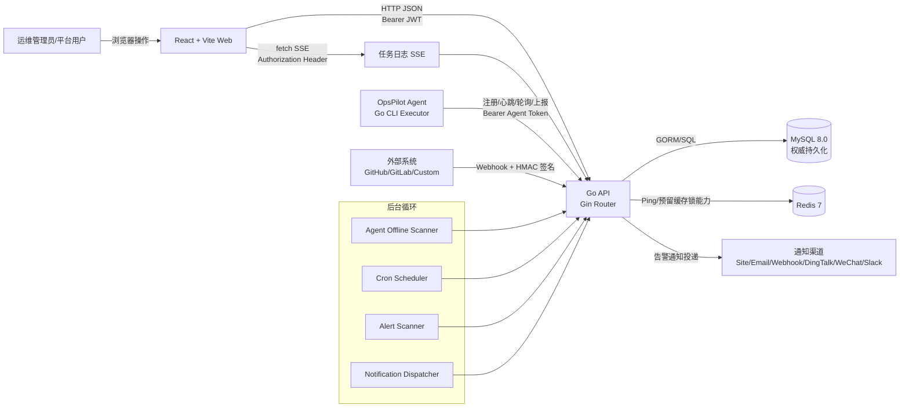
```mermaid
flowchart LR
  Admin["运维管理员/平台用户"] -->|"浏览器操作"| Web["React + Vite Web"]
  Web -->|"HTTP JSON<br/>Bearer JWT"| API["Go API<br/>Gin Router"]
  Web -->|"fetch SSE<br/>Authorization Header"| LogStream["任务日志 SSE"]
  LogStream --> API

  Agent["OpsPilot Agent<br/>Go CLI Executor"] -->|"注册/心跳/轮询/上报<br/>Bearer Agent Token"| API
  External["外部系统<br/>GitHub/GitLab/Custom"] -->|"Webhook + HMAC 签名"| API

  API -->|"GORM/SQL"| MySQL[("MySQL 8.0<br/>权威持久化")]
  API -->|"Ping/预留缓存锁能力"| Redis[("Redis 7")]

  API -->|"告警通知投递"| Channels["通知渠道<br/>Site/Email/Webhook/DingTalk/WeChat/Slack"]

  subgraph "后台循环"
    OfflineScanner["Agent Offline Scanner"]
    Scheduler["Cron Scheduler"]
    AlertScanner["Alert Scanner"]
    Dispatcher["Notification Dispatcher"]
  end

  OfflineScanner --> API
  Scheduler --> API
  AlertScanner --> API
  Dispatcher --> API
```

## 2. 后端分层组件图

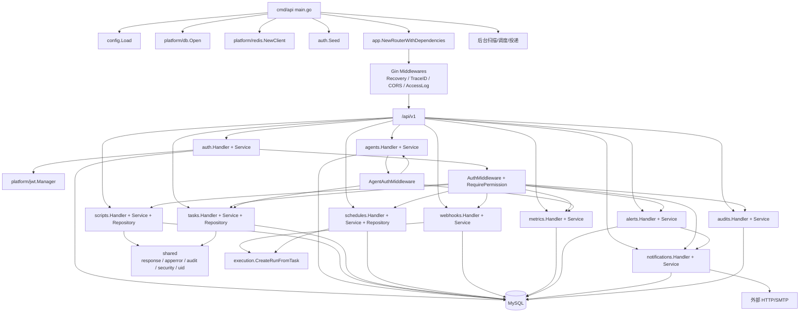
```mermaid
flowchart TB
  Main["cmd/api main.go"] --> Config["config.Load"]
  Main --> DB["platform/db.Open"]
  Main --> Redis["platform/redis.NewClient"]
  Main --> Seed["auth.Seed"]
  Main --> Router["app.NewRouterWithDependencies"]
  Main --> Workers["后台扫描/调度/投递"]

  Router --> Middleware["Gin Middlewares<br/>Recovery / TraceID / CORS / AccessLog"]
  Middleware --> APIGroup["/api/v1"]

  APIGroup --> Auth["auth.Handler + Service"]
  APIGroup --> Agents["agents.Handler + Service"]
  APIGroup --> Scripts["scripts.Handler + Service + Repository"]
  APIGroup --> Tasks["tasks.Handler + Service + Repository"]
  APIGroup --> Schedules["schedules.Handler + Service + Repository"]
  APIGroup --> Webhooks["webhooks.Handler + Service"]
  APIGroup --> Metrics["metrics.Handler + Service"]
  APIGroup --> Alerts["alerts.Handler + Service"]
  APIGroup --> Notifications["notifications.Handler + Service"]
  APIGroup --> Audits["audits.Handler + Service"]

  Auth --> JWT["platform/jwt.Manager"]
  Agents --> AgentAuth["AgentAuthMiddleware"]
  Auth --> UserAuth["AuthMiddleware + RequirePermission"]

  UserAuth --> Scripts
  UserAuth --> Tasks
  UserAuth --> Schedules
  UserAuth --> Webhooks
  UserAuth --> Metrics
  UserAuth --> Alerts
  UserAuth --> Notifications
  UserAuth --> Audits

  AgentAuth --> Tasks
  AgentAuth --> Metrics
  AgentAuth --> Agents

  Scripts --> Shared["shared<br/>response / apperror / audit / security / uid"]
  Tasks --> Shared
  Webhooks --> Execution["execution.CreateRunFromTask"]
  Schedules --> Execution
  Alerts --> Notifications
  Notifications --> ExternalHTTP["外部 HTTP/SMTP"]

  Auth --> MySQL[("MySQL")]
  Agents --> MySQL
  Scripts --> MySQL
  Tasks --> MySQL
  Schedules --> MySQL
  Webhooks --> MySQL
  Metrics --> MySQL
  Alerts --> MySQL
  Notifications --> MySQL
  Audits --> MySQL
```

## 3. 后端核心类/服务关系

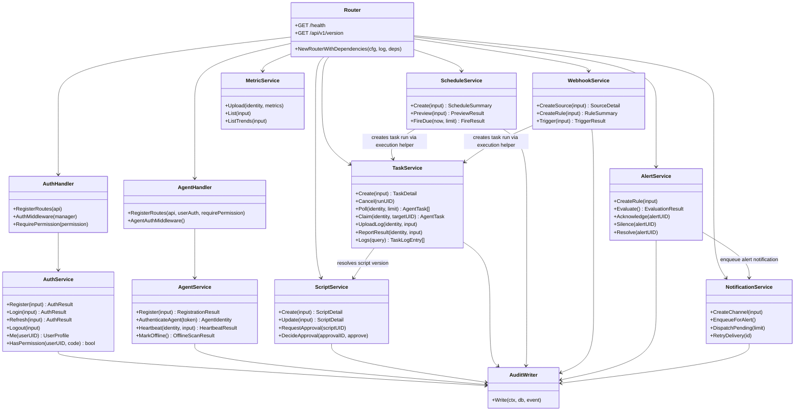
```mermaid
classDiagram
  class Router {
    +NewRouterWithDependencies(cfg, log, deps)
    +GET /health
    +GET /api/v1/version
  }

  class AuthHandler {
    +RegisterRoutes(api)
    +AuthMiddleware(manager)
    +RequirePermission(permission)
  }

  class AuthService {
    +Register(input) AuthResult
    +Login(input) AuthResult
    +Refresh(input) AuthResult
    +Logout(input)
    +Me(userUID) UserProfile
    +HasPermission(userUID, code) bool
  }

  class AgentHandler {
    +RegisterRoutes(api, userAuth, requirePermission)
    +AgentAuthMiddleware()
  }

  class AgentService {
    +Register(input) RegistrationResult
    +AuthenticateAgent(token) AgentIdentity
    +Heartbeat(identity, input) HeartbeatResult
    +MarkOffline() OfflineScanResult
  }

  class ScriptService {
    +Create(input) ScriptDetail
    +Update(input) ScriptDetail
    +RequestApproval(scriptUID)
    +DecideApproval(approvalID, approve)
  }

  class TaskService {
    +Create(input) TaskDetail
    +Cancel(runUID)
    +Poll(identity, limit) AgentTask[]
    +Claim(identity, targetUID) AgentTask
    +UploadLog(identity, input)
    +ReportResult(identity, input)
    +Logs(query) TaskLogEntry[]
  }

  class ScheduleService {
    +Create(input) ScheduleSummary
    +Preview(input) PreviewResult
    +FireDue(now, limit) FireResult
  }

  class WebhookService {
    +CreateSource(input) SourceDetail
    +CreateRule(input) RuleSummary
    +Trigger(input) TriggerResult
  }

  class MetricService {
    +Upload(identity, metrics)
    +List(input)
    +ListTrends(input)
  }

  class AlertService {
    +CreateRule(input)
    +Evaluate() EvaluationResult
    +Acknowledge(alertUID)
    +Silence(alertUID)
    +Resolve(alertUID)
  }

  class NotificationService {
    +CreateChannel(input)
    +EnqueueForAlert()
    +DispatchPending(limit)
    +RetryDelivery(id)
  }

  class AuditWriter {
    +Write(ctx, db, event)
  }

  Router --> AuthHandler
  Router --> AgentHandler
  Router --> ScriptService
  Router --> TaskService
  Router --> ScheduleService
  Router --> WebhookService
  Router --> MetricService
  Router --> AlertService
  Router --> NotificationService

  AuthHandler --> AuthService
  AgentHandler --> AgentService
  TaskService --> ScriptService : resolves script version
  ScheduleService --> TaskService : creates task run via execution helper
  WebhookService --> TaskService : creates task run via execution helper
  AlertService --> NotificationService : enqueue alert notification
  AuthService --> AuditWriter
  AgentService --> AuditWriter
  ScriptService --> AuditWriter
  TaskService --> AuditWriter
  ScheduleService --> AuditWriter
  WebhookService --> AuditWriter
  AlertService --> AuditWriter
  NotificationService --> AuditWriter
```

## 4. 前端模块、路由与权限守卫

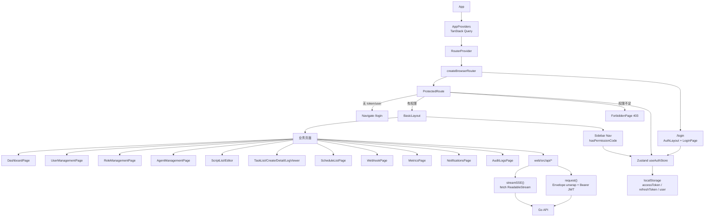
```mermaid
flowchart TB
  App["App"] --> Providers["AppProviders<br/>TanStack Query"]
  Providers --> RouterProvider["RouterProvider"]
  RouterProvider --> Router["createBrowserRouter"]

  Router --> Login["/login<br/>AuthLayout + LoginPage"]
  Router --> Protected["ProtectedRoute"]
  Protected -->|"无 token/user"| LoginRedirect["Navigate /login"]
  Protected -->|"有权限"| BasicLayout["BasicLayout"]
  Protected -->|"权限不足"| Forbidden["ForbiddenPage 403"]

  BasicLayout --> Nav["Sidebar Nav<br/>hasPermissionCode"]
  BasicLayout --> Pages["业务页面"]

  Pages --> Dashboard["DashboardPage"]
  Pages --> Users["UserManagementPage"]
  Pages --> Roles["RoleManagementPage"]
  Pages --> Agents["AgentManagementPage"]
  Pages --> Scripts["ScriptList/Editor"]
  Pages --> Tasks["TaskList/Create/Detail/LogViewer"]
  Pages --> Schedules["ScheduleListPage"]
  Pages --> Webhooks["WebhookPage"]
  Pages --> Metrics["MetricsPage"]
  Pages --> Notifications["NotificationsPage"]
  Pages --> Audits["AuditLogsPage"]

  Pages --> APIClient["web/src/api/*"]
  APIClient --> Request["request<T>()<br/>Envelope unwrap + Bearer JWT"]
  APIClient --> StreamSSE["streamSSE()<br/>fetch ReadableStream"]
  Request --> Backend["Go API"]
  StreamSSE --> Backend

  Login --> AuthStore["Zustand useAuthStore"]
  AuthStore --> LocalStorage["localStorage<br/>accessToken / refreshToken / user"]
  Protected --> AuthStore
  Nav --> AuthStore
```

## 5. 认证与 RBAC 时序图

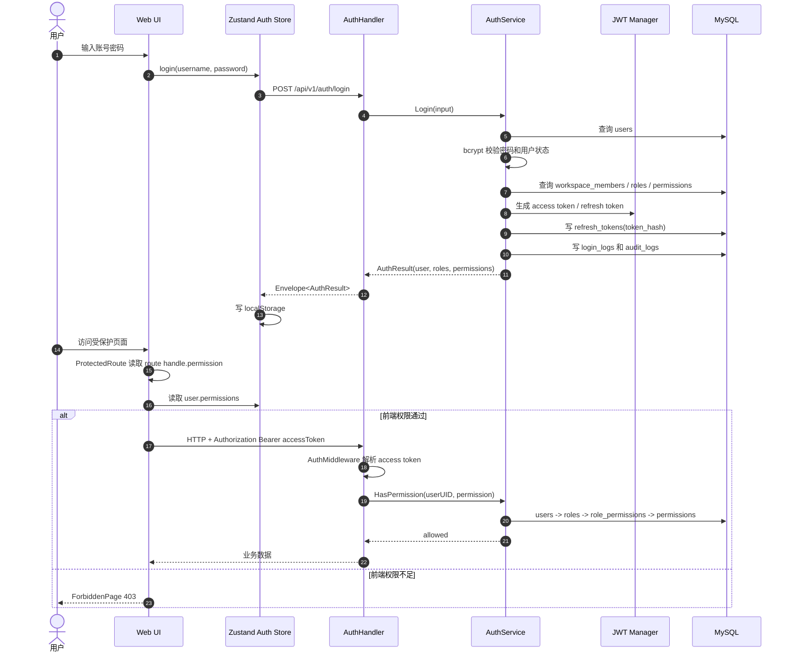
```mermaid
sequenceDiagram
  autonumber
  actor User as 用户
  participant Web as Web UI
  participant AuthStore as Zustand Auth Store
  participant API as AuthHandler
  participant Service as AuthService
  participant JWT as JWT Manager
  participant DB as MySQL

  User->>Web: 输入账号密码
  Web->>AuthStore: login(username, password)
  AuthStore->>API: POST /api/v1/auth/login
  API->>Service: Login(input)
  Service->>DB: 查询 users
  Service->>Service: bcrypt 校验密码和用户状态
  Service->>DB: 查询 workspace_members / roles / permissions
  Service->>JWT: 生成 access token / refresh token
  Service->>DB: 写 refresh_tokens(token_hash)
  Service->>DB: 写 login_logs 和 audit_logs
  Service-->>API: AuthResult(user, roles, permissions)
  API-->>AuthStore: Envelope<AuthResult>
  AuthStore->>AuthStore: 写 localStorage

  User->>Web: 访问受保护页面
  Web->>Web: ProtectedRoute 读取 route handle.permission
  Web->>AuthStore: 读取 user.permissions
  alt 前端权限通过
    Web->>API: HTTP + Authorization Bearer accessToken
    API->>API: AuthMiddleware 解析 access token
    API->>Service: HasPermission(userUID, permission)
    Service->>DB: users -> roles -> role_permissions -> permissions
    Service-->>API: allowed
    API-->>Web: 业务数据
  else 前端权限不足
    Web-->>User: ForbiddenPage 403
  end
```

## 6. 认证/RBAC 数据模型

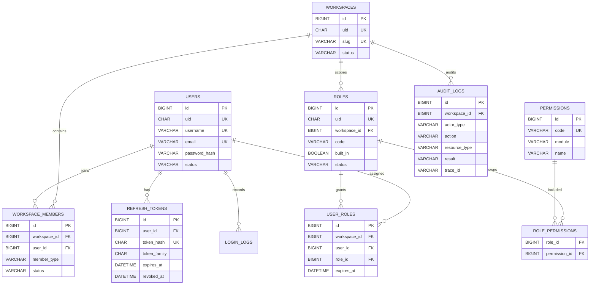
```mermaid
erDiagram
  WORKSPACES ||--o{ WORKSPACE_MEMBERS : contains
  USERS ||--o{ WORKSPACE_MEMBERS : joins
  WORKSPACES ||--o{ ROLES : scopes
  USERS ||--o{ USER_ROLES : assigned
  ROLES ||--o{ USER_ROLES : grants
  ROLES ||--o{ ROLE_PERMISSIONS : owns
  PERMISSIONS ||--o{ ROLE_PERMISSIONS : included
  USERS ||--o{ REFRESH_TOKENS : has
  USERS ||--o{ LOGIN_LOGS : records
  WORKSPACES ||--o{ AUDIT_LOGS : audits

  WORKSPACES {
    BIGINT id PK
    CHAR uid UK
    VARCHAR slug UK
    VARCHAR status
  }
  USERS {
    BIGINT id PK
    CHAR uid UK
    VARCHAR username UK
    VARCHAR email UK
    VARCHAR password_hash
    VARCHAR status
  }
  WORKSPACE_MEMBERS {
    BIGINT id PK
    BIGINT workspace_id FK
    BIGINT user_id FK
    VARCHAR member_type
    VARCHAR status
  }
  ROLES {
    BIGINT id PK
    CHAR uid UK
    BIGINT workspace_id FK
    VARCHAR code
    BOOLEAN built_in
    VARCHAR status
  }
  PERMISSIONS {
    BIGINT id PK
    VARCHAR code UK
    VARCHAR module
    VARCHAR name
  }
  USER_ROLES {
    BIGINT id PK
    BIGINT workspace_id FK
    BIGINT user_id FK
    BIGINT role_id FK
    DATETIME expires_at
  }
  ROLE_PERMISSIONS {
    BIGINT role_id FK
    BIGINT permission_id FK
  }
  REFRESH_TOKENS {
    BIGINT id PK
    BIGINT user_id FK
    CHAR token_hash UK
    CHAR token_family
    DATETIME expires_at
    DATETIME revoked_at
  }
  AUDIT_LOGS {
    BIGINT id PK
    BIGINT workspace_id FK
    VARCHAR actor_type
    VARCHAR action
    VARCHAR resource_type
    VARCHAR result
    VARCHAR trace_id
  }
```

## 7. Agent 注册、鉴权与心跳

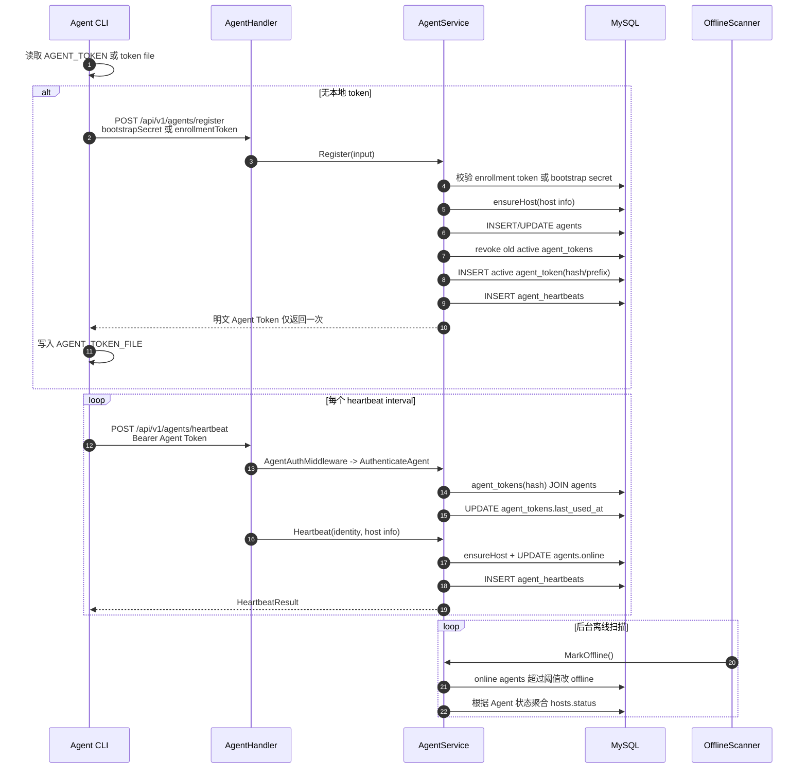
```mermaid
sequenceDiagram
  autonumber
  participant Agent as Agent CLI
  participant API as AgentHandler
  participant Service as AgentService
  participant DB as MySQL
  participant Scanner as OfflineScanner

  Agent->>Agent: 读取 AGENT_TOKEN 或 token file
  alt 无本地 token
    Agent->>API: POST /api/v1/agents/register<br/>bootstrapSecret 或 enrollmentToken
    API->>Service: Register(input)
    Service->>DB: 校验 enrollment token 或 bootstrap secret
    Service->>DB: ensureHost(host info)
    Service->>DB: INSERT/UPDATE agents
    Service->>DB: revoke old active agent_tokens
    Service->>DB: INSERT active agent_token(hash/prefix)
    Service->>DB: INSERT agent_heartbeats
    Service-->>Agent: 明文 Agent Token 仅返回一次
    Agent->>Agent: 写入 AGENT_TOKEN_FILE
  end

  loop 每个 heartbeat interval
    Agent->>API: POST /api/v1/agents/heartbeat<br/>Bearer Agent Token
    API->>Service: AgentAuthMiddleware -> AuthenticateAgent
    Service->>DB: agent_tokens(hash) JOIN agents
    Service->>DB: UPDATE agent_tokens.last_used_at
    API->>Service: Heartbeat(identity, host info)
    Service->>DB: ensureHost + UPDATE agents.online
    Service->>DB: INSERT agent_heartbeats
    Service-->>Agent: HeartbeatResult
  end

  loop 后台离线扫描
    Scanner->>Service: MarkOffline()
    Service->>DB: online agents 超过阈值改 offline
    Service->>DB: 根据 Agent 状态聚合 hosts.status
  end
```

## 8. Agent/Host 数据模型

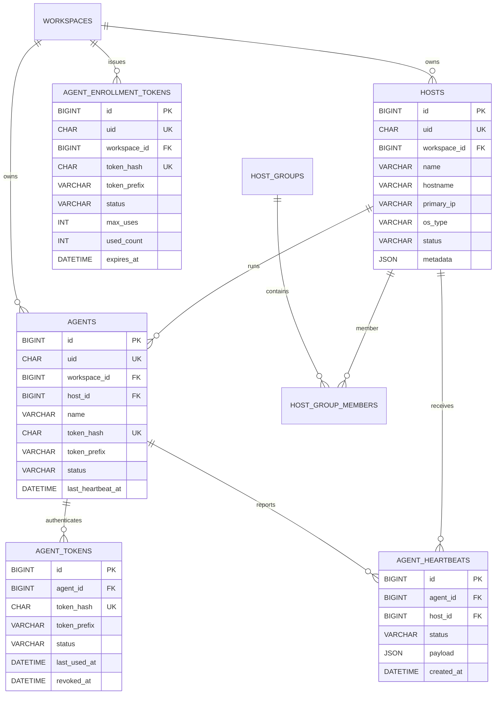
```mermaid
erDiagram
  WORKSPACES ||--o{ HOSTS : owns
  WORKSPACES ||--o{ AGENTS : owns
  HOSTS ||--o{ AGENTS : runs
  AGENTS ||--o{ AGENT_TOKENS : authenticates
  AGENTS ||--o{ AGENT_HEARTBEATS : reports
  HOSTS ||--o{ AGENT_HEARTBEATS : receives
  WORKSPACES ||--o{ AGENT_ENROLLMENT_TOKENS : issues
  HOST_GROUPS ||--o{ HOST_GROUP_MEMBERS : contains
  HOSTS ||--o{ HOST_GROUP_MEMBERS : member

  HOSTS {
    BIGINT id PK
    CHAR uid UK
    BIGINT workspace_id FK
    VARCHAR name
    VARCHAR hostname
    VARCHAR primary_ip
    VARCHAR os_type
    VARCHAR status
    JSON metadata
  }
  AGENTS {
    BIGINT id PK
    CHAR uid UK
    BIGINT workspace_id FK
    BIGINT host_id FK
    VARCHAR name
    CHAR token_hash UK
    VARCHAR token_prefix
    VARCHAR status
    DATETIME last_heartbeat_at
  }
  AGENT_TOKENS {
    BIGINT id PK
    BIGINT agent_id FK
    CHAR token_hash UK
    VARCHAR token_prefix
    VARCHAR status
    DATETIME last_used_at
    DATETIME revoked_at
  }
  AGENT_HEARTBEATS {
    BIGINT id PK
    BIGINT agent_id FK
    BIGINT host_id FK
    VARCHAR status
    JSON payload
    DATETIME created_at
  }
  AGENT_ENROLLMENT_TOKENS {
    BIGINT id PK
    CHAR uid UK
    BIGINT workspace_id FK
    CHAR token_hash UK
    VARCHAR token_prefix
    VARCHAR status
    INT max_uses
    INT used_count
    DATETIME expires_at
  }
```

## 9. 脚本模板、版本与审批模型

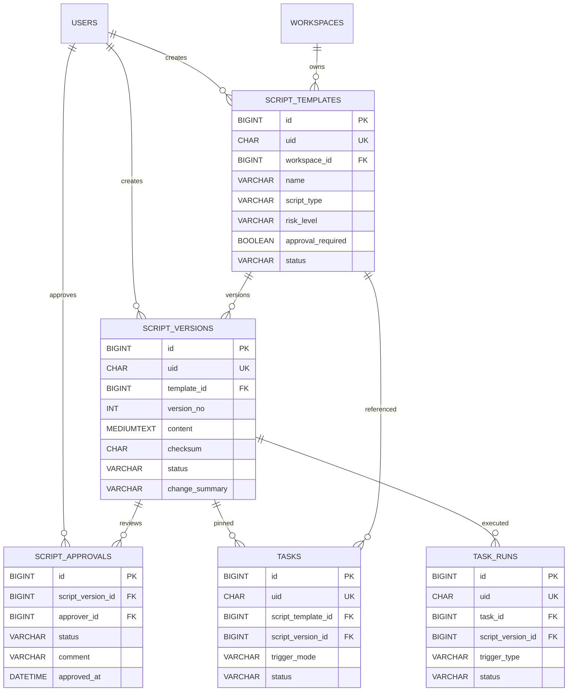
```mermaid
erDiagram
  WORKSPACES ||--o{ SCRIPT_TEMPLATES : owns
  SCRIPT_TEMPLATES ||--o{ SCRIPT_VERSIONS : versions
  SCRIPT_VERSIONS ||--o{ SCRIPT_APPROVALS : reviews
  USERS ||--o{ SCRIPT_TEMPLATES : creates
  USERS ||--o{ SCRIPT_VERSIONS : creates
  USERS ||--o{ SCRIPT_APPROVALS : approves
  SCRIPT_TEMPLATES ||--o{ TASKS : referenced
  SCRIPT_VERSIONS ||--o{ TASKS : pinned
  SCRIPT_VERSIONS ||--o{ TASK_RUNS : executed

  SCRIPT_TEMPLATES {
    BIGINT id PK
    CHAR uid UK
    BIGINT workspace_id FK
    VARCHAR name
    VARCHAR script_type
    VARCHAR risk_level
    BOOLEAN approval_required
    VARCHAR status
  }
  SCRIPT_VERSIONS {
    BIGINT id PK
    CHAR uid UK
    BIGINT template_id FK
    INT version_no
    MEDIUMTEXT content
    CHAR checksum
    VARCHAR status
    VARCHAR change_summary
  }
  SCRIPT_APPROVALS {
    BIGINT id PK
    BIGINT script_version_id FK
    BIGINT approver_id FK
    VARCHAR status
    VARCHAR comment
    DATETIME approved_at
  }
  TASKS {
    BIGINT id PK
    CHAR uid UK
    BIGINT script_template_id FK
    BIGINT script_version_id FK
    VARCHAR trigger_mode
    VARCHAR status
  }
  TASK_RUNS {
    BIGINT id PK
    CHAR uid UK
    BIGINT task_id FK
    BIGINT script_version_id FK
    VARCHAR trigger_type
    VARCHAR status
  }
```

## 10. 脚本审批与任务创建流程

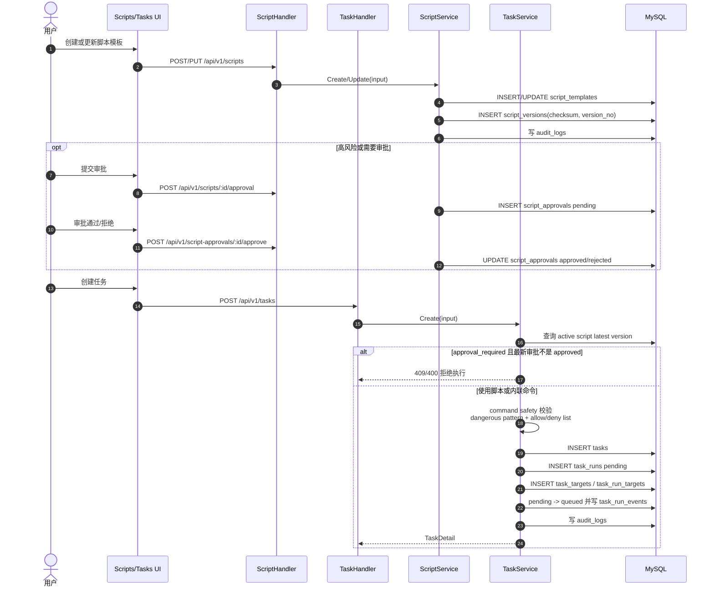
```mermaid
sequenceDiagram
  autonumber
  actor User as 用户
  participant Web as Scripts/Tasks UI
  participant ScriptAPI as ScriptHandler
  participant TaskAPI as TaskHandler
  participant ScriptSvc as ScriptService
  participant TaskSvc as TaskService
  participant DB as MySQL

  User->>Web: 创建或更新脚本模板
  Web->>ScriptAPI: POST/PUT /api/v1/scripts
  ScriptAPI->>ScriptSvc: Create/Update(input)
  ScriptSvc->>DB: INSERT/UPDATE script_templates
  ScriptSvc->>DB: INSERT script_versions(checksum, version_no)
  ScriptSvc->>DB: 写 audit_logs

  opt 高风险或需要审批
    User->>Web: 提交审批
    Web->>ScriptAPI: POST /api/v1/scripts/:id/approval
    ScriptSvc->>DB: INSERT script_approvals pending
    User->>Web: 审批通过/拒绝
    Web->>ScriptAPI: POST /api/v1/script-approvals/:id/approve
    ScriptSvc->>DB: UPDATE script_approvals approved/rejected
  end

  User->>Web: 创建任务
  Web->>TaskAPI: POST /api/v1/tasks
  TaskAPI->>TaskSvc: Create(input)
  TaskSvc->>DB: 查询 active script latest version
  alt approval_required 且最新审批不是 approved
    TaskSvc-->>TaskAPI: 409/400 拒绝执行
  else 使用脚本或内联命令
    TaskSvc->>TaskSvc: command safety 校验<br/>dangerous pattern + allow/deny list
    TaskSvc->>DB: INSERT tasks
    TaskSvc->>DB: INSERT task_runs pending
    TaskSvc->>DB: INSERT task_targets / task_run_targets
    TaskSvc->>DB: pending -> queued 并写 task_run_events
    TaskSvc->>DB: 写 audit_logs
    TaskSvc-->>TaskAPI: TaskDetail
  end
```

## 11. 任务执行核心数据模型

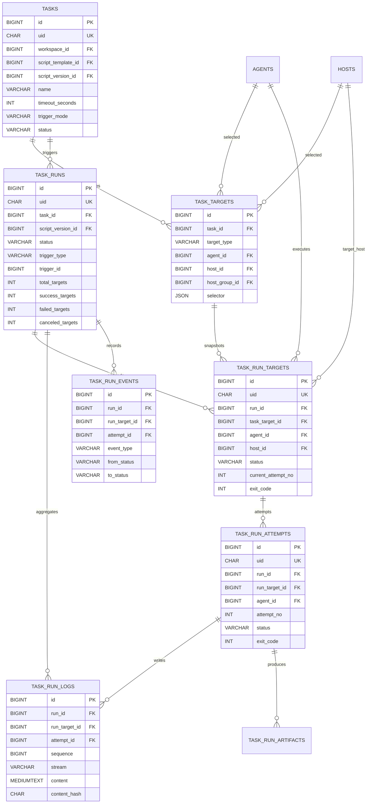
```mermaid
erDiagram
  TASKS ||--o{ TASK_TARGETS : defines
  TASKS ||--o{ TASK_RUNS : triggers
  TASK_RUNS ||--o{ TASK_RUN_TARGETS : expands
  TASK_TARGETS ||--o{ TASK_RUN_TARGETS : snapshots
  TASK_RUN_TARGETS ||--o{ TASK_RUN_ATTEMPTS : attempts
  TASK_RUN_ATTEMPTS ||--o{ TASK_RUN_LOGS : writes
  TASK_RUNS ||--o{ TASK_RUN_LOGS : aggregates
  TASK_RUNS ||--o{ TASK_RUN_EVENTS : records
  TASK_RUN_ATTEMPTS ||--o{ TASK_RUN_ARTIFACTS : produces
  AGENTS ||--o{ TASK_TARGETS : selected
  HOSTS ||--o{ TASK_TARGETS : selected
  AGENTS ||--o{ TASK_RUN_TARGETS : executes
  HOSTS ||--o{ TASK_RUN_TARGETS : target_host

  TASKS {
    BIGINT id PK
    CHAR uid UK
    BIGINT workspace_id FK
    BIGINT script_template_id FK
    BIGINT script_version_id FK
    VARCHAR name
    INT timeout_seconds
    VARCHAR trigger_mode
    VARCHAR status
  }
  TASK_TARGETS {
    BIGINT id PK
    BIGINT task_id FK
    VARCHAR target_type
    BIGINT agent_id FK
    BIGINT host_id FK
    BIGINT host_group_id FK
    JSON selector
  }
  TASK_RUNS {
    BIGINT id PK
    CHAR uid UK
    BIGINT task_id FK
    BIGINT script_version_id FK
    VARCHAR status
    VARCHAR trigger_type
    BIGINT trigger_id
    INT total_targets
    INT success_targets
    INT failed_targets
    INT canceled_targets
  }
  TASK_RUN_TARGETS {
    BIGINT id PK
    CHAR uid UK
    BIGINT run_id FK
    BIGINT task_target_id FK
    BIGINT agent_id FK
    BIGINT host_id FK
    VARCHAR status
    INT current_attempt_no
    INT exit_code
  }
  TASK_RUN_ATTEMPTS {
    BIGINT id PK
    CHAR uid UK
    BIGINT run_id FK
    BIGINT run_target_id FK
    BIGINT agent_id FK
    INT attempt_no
    VARCHAR status
    INT exit_code
  }
  TASK_RUN_LOGS {
    BIGINT id PK
    BIGINT run_id FK
    BIGINT run_target_id FK
    BIGINT attempt_id FK
    BIGINT sequence
    VARCHAR stream
    MEDIUMTEXT content
    CHAR content_hash
  }
  TASK_RUN_EVENTS {
    BIGINT id PK
    BIGINT run_id FK
    BIGINT run_target_id FK
    BIGINT attempt_id FK
    VARCHAR event_type
    VARCHAR from_status
    VARCHAR to_status
  }
```

## 12. 任务执行时序图

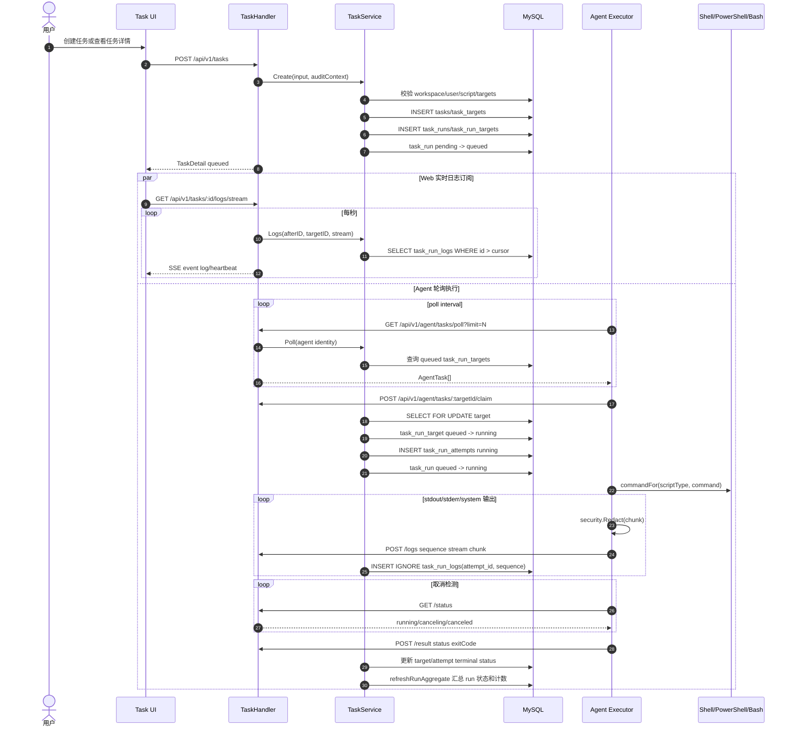
```mermaid
sequenceDiagram
  autonumber
  actor User as 用户
  participant Web as Task UI
  participant API as TaskHandler
  participant Service as TaskService
  participant DB as MySQL
  participant Agent as Agent Executor
  participant OS as Shell/PowerShell/Bash

  User->>Web: 创建任务或查看任务详情
  Web->>API: POST /api/v1/tasks
  API->>Service: Create(input, auditContext)
  Service->>DB: 校验 workspace/user/script/targets
  Service->>DB: INSERT tasks/task_targets
  Service->>DB: INSERT task_runs/task_run_targets
  Service->>DB: task_run pending -> queued
  API-->>Web: TaskDetail queued

  par Web 实时日志订阅
    Web->>API: GET /api/v1/tasks/:id/logs/stream
    loop 每秒
      API->>Service: Logs(afterID, targetID, stream)
      Service->>DB: SELECT task_run_logs WHERE id > cursor
      API-->>Web: SSE event log/heartbeat
    end
  and Agent 轮询执行
    loop poll interval
      Agent->>API: GET /api/v1/agent/tasks/poll?limit=N
      API->>Service: Poll(agent identity)
      Service->>DB: 查询 queued task_run_targets
      API-->>Agent: AgentTask[]
    end
    Agent->>API: POST /api/v1/agent/tasks/:targetId/claim
    Service->>DB: SELECT FOR UPDATE target
    Service->>DB: task_run_target queued -> running
    Service->>DB: INSERT task_run_attempts running
    Service->>DB: task_run queued -> running
    Agent->>OS: commandFor(scriptType, command)
    loop stdout/stderr/system 输出
      Agent->>Agent: security.Redact(chunk)
      Agent->>API: POST /logs sequence stream chunk
      Service->>DB: INSERT IGNORE task_run_logs(attempt_id, sequence)
    end
    loop 取消检测
      Agent->>API: GET /status
      API-->>Agent: running/canceling/canceled
    end
    Agent->>API: POST /result status exitCode
    Service->>DB: 更新 target/attempt terminal status
    Service->>DB: refreshRunAggregate 汇总 run 状态和计数
  end
```

## 13. 任务状态机

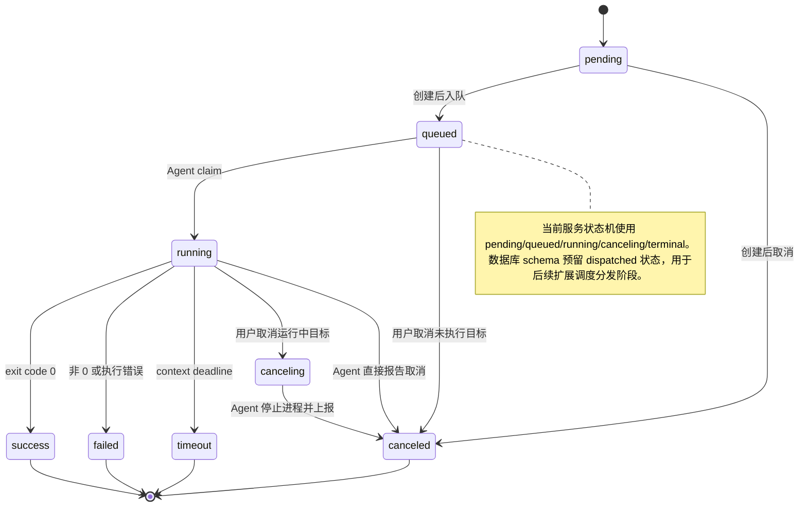
```mermaid
stateDiagram-v2
  [*] --> pending
  pending --> queued: 创建后入队
  pending --> canceled: 创建后取消

  queued --> running: Agent claim
  queued --> canceled: 用户取消未执行目标

  running --> success: exit code 0
  running --> failed: 非 0 或执行错误
  running --> timeout: context deadline
  running --> canceling: 用户取消运行中目标
  running --> canceled: Agent 直接报告取消

  canceling --> canceled: Agent 停止进程并上报

  success --> [*]
  failed --> [*]
  timeout --> [*]
  canceled --> [*]

  note right of queued
    当前服务状态机使用 pending/queued/running/canceling/terminal。
    数据库 schema 预留 dispatched 状态，用于后续扩展调度分发阶段。
  end note
```

## 14. 任务触发来源统一模型

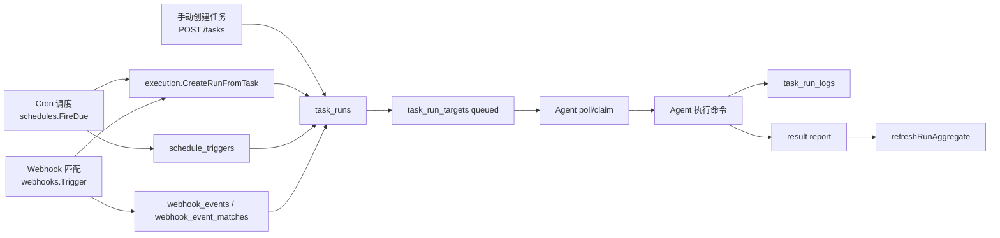
```mermaid
flowchart LR
  Manual["手动创建任务<br/>POST /tasks"] --> TaskRun["task_runs"]
  Schedule["Cron 调度<br/>schedules.FireDue"] --> Helper["execution.CreateRunFromTask"]
  Webhook["Webhook 匹配<br/>webhooks.Trigger"] --> Helper
  Helper --> TaskRun

  TaskRun --> Targets["task_run_targets queued"]
  Targets --> AgentPoll["Agent poll/claim"]
  AgentPoll --> Execute["Agent 执行命令"]
  Execute --> Logs["task_run_logs"]
  Execute --> Result["result report"]
  Result --> Aggregate["refreshRunAggregate"]

  Schedule --> TriggerRecord["schedule_triggers"]
  Webhook --> EventRecord["webhook_events / webhook_event_matches"]
  TriggerRecord --> TaskRun
  EventRecord --> TaskRun
```

## 15. Cron 调度时序

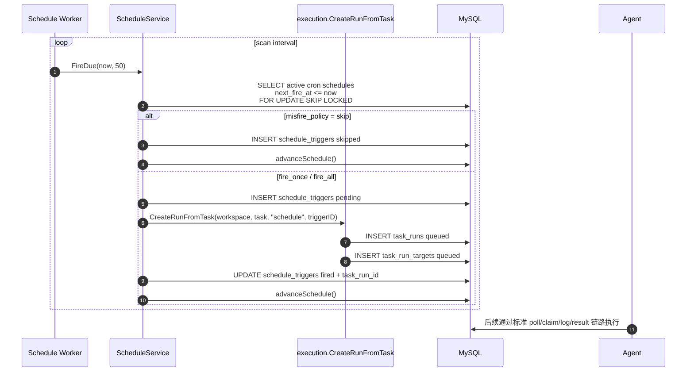
```mermaid
sequenceDiagram
  autonumber
  participant Worker as Schedule Worker
  participant Svc as ScheduleService
  participant Exec as execution.CreateRunFromTask
  participant DB as MySQL
  participant Agent as Agent

  loop scan interval
    Worker->>Svc: FireDue(now, 50)
    Svc->>DB: SELECT active cron schedules<br/>next_fire_at <= now<br/>FOR UPDATE SKIP LOCKED
    alt misfire_policy = skip
      Svc->>DB: INSERT schedule_triggers skipped
      Svc->>DB: advanceSchedule()
    else fire_once / fire_all
      Svc->>DB: INSERT schedule_triggers pending
      Svc->>Exec: CreateRunFromTask(workspace, task, "schedule", triggerID)
      Exec->>DB: INSERT task_runs queued
      Exec->>DB: INSERT task_run_targets queued
      Svc->>DB: UPDATE schedule_triggers fired + task_run_id
      Svc->>DB: advanceSchedule()
    end
  end
  Agent->>DB: 后续通过标准 poll/claim/log/result 链路执行
```

## 16. Webhook 安全触发时序

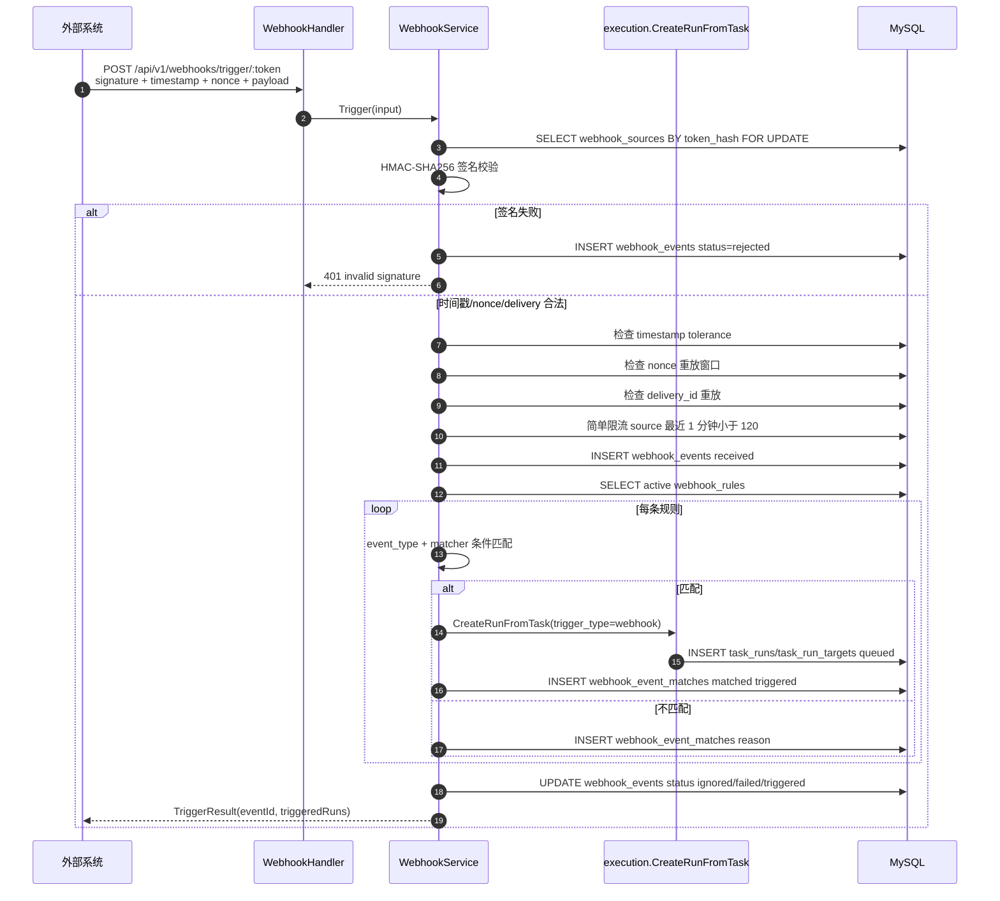
```mermaid
sequenceDiagram
  autonumber
  participant External as 外部系统
  participant API as WebhookHandler
  participant Svc as WebhookService
  participant Exec as execution.CreateRunFromTask
  participant DB as MySQL

  External->>API: POST /api/v1/webhooks/trigger/:token<br/>signature + timestamp + nonce + payload
  API->>Svc: Trigger(input)
  Svc->>DB: SELECT webhook_sources BY token_hash FOR UPDATE
  Svc->>Svc: HMAC-SHA256 签名校验
  alt 签名失败
    Svc->>DB: INSERT webhook_events status=rejected
    Svc-->>API: 401 invalid signature
  else 时间戳/nonce/delivery 合法
    Svc->>DB: 检查 timestamp tolerance
    Svc->>DB: 检查 nonce 重放窗口
    Svc->>DB: 检查 delivery_id 重放
    Svc->>DB: 简单限流 source 最近 1 分钟小于 120
    Svc->>DB: INSERT webhook_events received
    Svc->>DB: SELECT active webhook_rules
    loop 每条规则
      Svc->>Svc: event_type + matcher 条件匹配
      alt 匹配
        Svc->>Exec: CreateRunFromTask(trigger_type=webhook)
        Exec->>DB: INSERT task_runs/task_run_targets queued
        Svc->>DB: INSERT webhook_event_matches matched triggered
      else 不匹配
        Svc->>DB: INSERT webhook_event_matches reason
      end
    end
    Svc->>DB: UPDATE webhook_events status ignored/failed/triggered
    Svc-->>External: TriggerResult(eventId, triggeredRuns)
  end
```

## 17. 调度/Webhook 数据模型

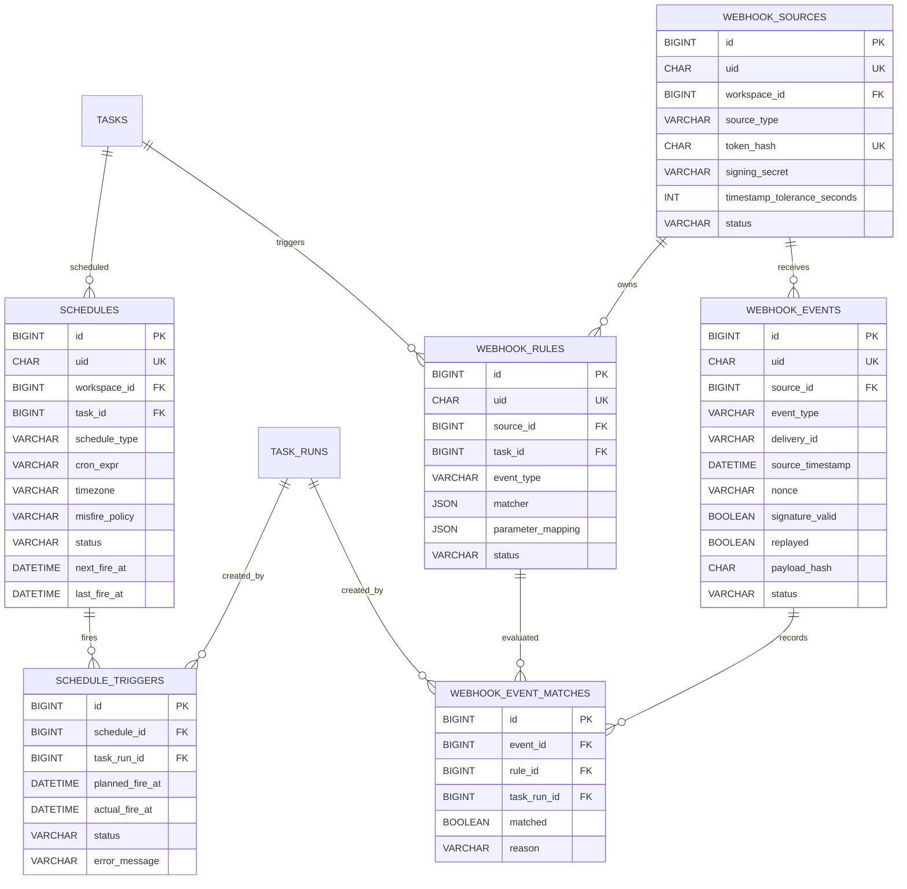
```mermaid
erDiagram
  TASKS ||--o{ SCHEDULES : scheduled
  SCHEDULES ||--o{ SCHEDULE_TRIGGERS : fires
  TASK_RUNS ||--o{ SCHEDULE_TRIGGERS : created_by

  WEBHOOK_SOURCES ||--o{ WEBHOOK_RULES : owns
  TASKS ||--o{ WEBHOOK_RULES : triggers
  WEBHOOK_SOURCES ||--o{ WEBHOOK_EVENTS : receives
  WEBHOOK_EVENTS ||--o{ WEBHOOK_EVENT_MATCHES : records
  WEBHOOK_RULES ||--o{ WEBHOOK_EVENT_MATCHES : evaluated
  TASK_RUNS ||--o{ WEBHOOK_EVENT_MATCHES : created_by

  SCHEDULES {
    BIGINT id PK
    CHAR uid UK
    BIGINT workspace_id FK
    BIGINT task_id FK
    VARCHAR schedule_type
    VARCHAR cron_expr
    VARCHAR timezone
    VARCHAR misfire_policy
    VARCHAR status
    DATETIME next_fire_at
    DATETIME last_fire_at
  }
  SCHEDULE_TRIGGERS {
    BIGINT id PK
    BIGINT schedule_id FK
    BIGINT task_run_id FK
    DATETIME planned_fire_at
    DATETIME actual_fire_at
    VARCHAR status
    VARCHAR error_message
  }
  WEBHOOK_SOURCES {
    BIGINT id PK
    CHAR uid UK
    BIGINT workspace_id FK
    VARCHAR source_type
    CHAR token_hash UK
    VARCHAR signing_secret
    INT timestamp_tolerance_seconds
    VARCHAR status
  }
  WEBHOOK_RULES {
    BIGINT id PK
    CHAR uid UK
    BIGINT source_id FK
    BIGINT task_id FK
    VARCHAR event_type
    JSON matcher
    JSON parameter_mapping
    VARCHAR status
  }
  WEBHOOK_EVENTS {
    BIGINT id PK
    CHAR uid UK
    BIGINT source_id FK
    VARCHAR event_type
    VARCHAR delivery_id
    DATETIME source_timestamp
    VARCHAR nonce
    BOOLEAN signature_valid
    BOOLEAN replayed
    CHAR payload_hash
    VARCHAR status
  }
  WEBHOOK_EVENT_MATCHES {
    BIGINT id PK
    BIGINT event_id FK
    BIGINT rule_id FK
    BIGINT task_run_id FK
    BOOLEAN matched
    VARCHAR reason
  }
```

## 18. 监控、告警与通知闭环

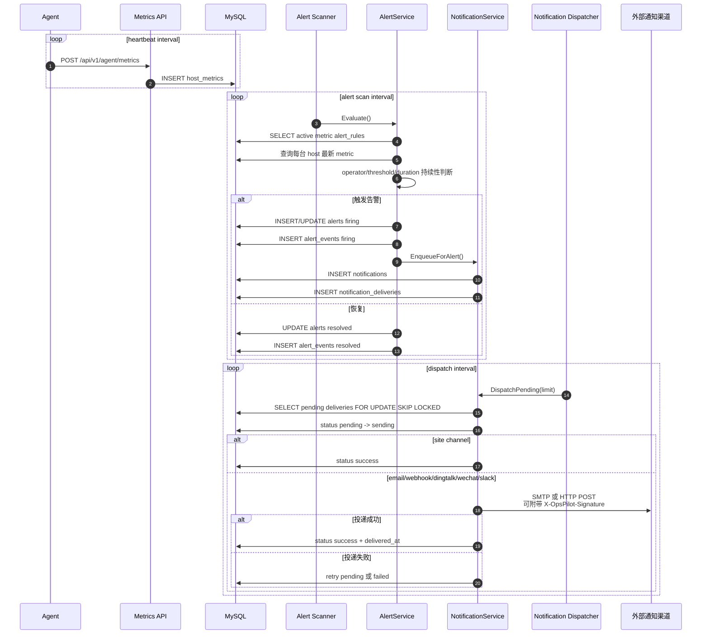
```mermaid
sequenceDiagram
  autonumber
  participant Agent as Agent
  participant MetricAPI as Metrics API
  participant DB as MySQL
  participant AlertWorker as Alert Scanner
  participant AlertSvc as AlertService
  participant Notify as NotificationService
  participant Dispatcher as Notification Dispatcher
  participant Channel as 外部通知渠道

  loop heartbeat interval
    Agent->>MetricAPI: POST /api/v1/agent/metrics
    MetricAPI->>DB: INSERT host_metrics
  end

  loop alert scan interval
    AlertWorker->>AlertSvc: Evaluate()
    AlertSvc->>DB: SELECT active metric alert_rules
    AlertSvc->>DB: 查询每台 host 最新 metric
    AlertSvc->>AlertSvc: operator/threshold/duration 持续性判断
    alt 触发告警
      AlertSvc->>DB: INSERT/UPDATE alerts firing
      AlertSvc->>DB: INSERT alert_events firing
      AlertSvc->>Notify: EnqueueForAlert()
      Notify->>DB: INSERT notifications
      Notify->>DB: INSERT notification_deliveries
    else 恢复
      AlertSvc->>DB: UPDATE alerts resolved
      AlertSvc->>DB: INSERT alert_events resolved
    end
  end

  loop dispatch interval
    Dispatcher->>Notify: DispatchPending(limit)
    Notify->>DB: SELECT pending deliveries FOR UPDATE SKIP LOCKED
    Notify->>DB: status pending -> sending
    alt site channel
      Notify->>DB: status success
    else email/webhook/dingtalk/wechat/slack
      Notify->>Channel: SMTP 或 HTTP POST<br/>可附带 X-OpsPilot-Signature
      alt 投递成功
        Notify->>DB: status success + delivered_at
      else 投递失败
        Notify->>DB: retry pending 或 failed
      end
    end
  end
```

## 19. 监控告警通知数据模型

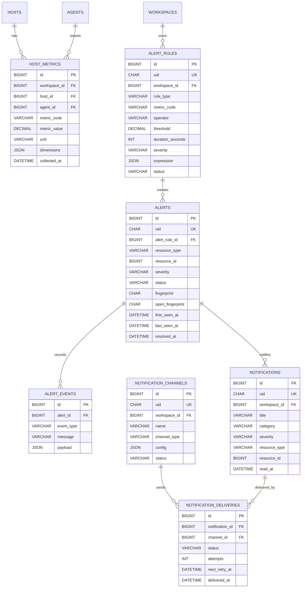
```mermaid
erDiagram
  HOSTS ||--o{ HOST_METRICS : has
  AGENTS ||--o{ HOST_METRICS : reports
  WORKSPACES ||--o{ ALERT_RULES : owns
  ALERT_RULES ||--o{ ALERTS : creates
  ALERTS ||--o{ ALERT_EVENTS : records
  ALERTS ||--o{ NOTIFICATIONS : notifies
  NOTIFICATION_CHANNELS ||--o{ NOTIFICATION_DELIVERIES : sends
  NOTIFICATIONS ||--o{ NOTIFICATION_DELIVERIES : delivered_by

  HOST_METRICS {
    BIGINT id PK
    BIGINT workspace_id FK
    BIGINT host_id FK
    BIGINT agent_id FK
    VARCHAR metric_code
    DECIMAL metric_value
    VARCHAR unit
    JSON dimensions
    DATETIME collected_at
  }
  ALERT_RULES {
    BIGINT id PK
    CHAR uid UK
    BIGINT workspace_id FK
    VARCHAR rule_type
    VARCHAR metric_code
    VARCHAR operator
    DECIMAL threshold
    INT duration_seconds
    VARCHAR severity
    JSON expression
    VARCHAR status
  }
  ALERTS {
    BIGINT id PK
    CHAR uid UK
    BIGINT alert_rule_id FK
    VARCHAR resource_type
    BIGINT resource_id
    VARCHAR severity
    VARCHAR status
    CHAR fingerprint
    CHAR open_fingerprint
    DATETIME first_seen_at
    DATETIME last_seen_at
    DATETIME resolved_at
  }
  ALERT_EVENTS {
    BIGINT id PK
    BIGINT alert_id FK
    VARCHAR event_type
    VARCHAR message
    JSON payload
  }
  NOTIFICATION_CHANNELS {
    BIGINT id PK
    CHAR uid UK
    BIGINT workspace_id FK
    VARCHAR name
    VARCHAR channel_type
    JSON config
    VARCHAR status
  }
  NOTIFICATIONS {
    BIGINT id PK
    CHAR uid UK
    BIGINT workspace_id FK
    VARCHAR title
    VARCHAR category
    VARCHAR severity
    VARCHAR resource_type
    BIGINT resource_id
    DATETIME read_at
  }
  NOTIFICATION_DELIVERIES {
    BIGINT id PK
    BIGINT notification_id FK
    BIGINT channel_id FK
    VARCHAR status
    INT attempts
    DATETIME next_retry_at
    DATETIME delivered_at
  }
```

## 20. 后台 Worker 协作图

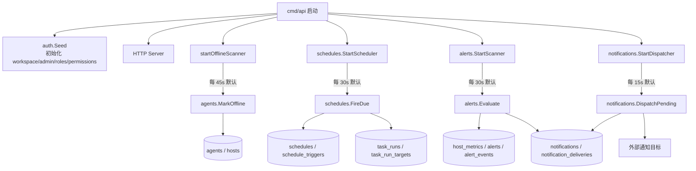
```mermaid
flowchart TB
  APIBoot["cmd/api 启动"] --> AuthSeed["auth.Seed<br/>初始化 workspace/admin/roles/permissions"]
  APIBoot --> HTTPServer["HTTP Server"]
  APIBoot --> Offline["startOfflineScanner"]
  APIBoot --> Scheduler["schedules.StartScheduler"]
  APIBoot --> Alert["alerts.StartScanner"]
  APIBoot --> Dispatcher["notifications.StartDispatcher"]

  Offline -->|"每 45s 默认"| MarkOffline["agents.MarkOffline"]
  Scheduler -->|"每 30s 默认"| FireDue["schedules.FireDue"]
  Alert -->|"每 30s 默认"| Evaluate["alerts.Evaluate"]
  Dispatcher -->|"每 15s 默认"| Dispatch["notifications.DispatchPending"]

  MarkOffline --> AgentsDB[("agents / hosts")]
  FireDue --> ScheduleDB[("schedules / schedule_triggers")]
  FireDue --> RunsDB[("task_runs / task_run_targets")]
  Evaluate --> MetricsDB[("host_metrics / alerts / alert_events")]
  Evaluate --> NotifyDB[("notifications / notification_deliveries")]
  Dispatch --> NotifyDB
  Dispatch --> External["外部通知目标"]
```

## 21. 部署视图

```mermaid
flowchart LR
  subgraph "Docker Compose: opspilot"
    MySQL["mysql:8.0.39<br/>opspilot-mysql"]
    Redis["redis:7-alpine<br/>opspilot-redis"]
    Migrate["migrate<br/>mysql client applies *.up.sql"]
    API["api<br/>server/Dockerfile<br/>/app/api :8080"]
    Web["web<br/>web/Dockerfile<br/>nginx :80 exposed as 5173"]
    Agent["agent<br/>server/Dockerfile<br/>/app/agent"]
  end

  MySQL -->|"healthcheck"| Migrate
  Migrate -->|"service_completed_successfully"| API
  MySQL --> API
  Redis --> API
  API --> Web
  API --> Agent

  Browser["Browser<br/>http://localhost:5173"] --> Web
  Web -->|"VITE_API_BASE_URL or same origin proxy"| API
  Agent -->|"AGENT_API_BASE_URL=http://api:8080"| API

  MySQLData[("opspilot-mysql-data")] --- MySQL
  RedisData[("opspilot-redis-data")] --- Redis
  AgentData[("opspilot-agent-data<br/>token/work dir")] --- Agent
```

## 22. 核心安全边界总览

```mermaid
flowchart TB
  subgraph "用户侧安全"
    JWTAuth["JWT access token"]
    Refresh["refresh_tokens 仅存 hash"]
    RBAC["RequirePermission<br/>DB 实时校验角色权限"]
    RouteGuard["前端 ProtectedRoute + nav/button 权限控制"]
  end

  subgraph "Agent 侧安全"
    AgentToken["Agent Token 独立于用户 JWT"]
    TokenHash["agent_tokens 仅存 hash/prefix"]
    Enrollment["bootstrap secret 或 enrollment token"]
    AgentScope["Agent 只能 claim 自己的 target"]
  end

  subgraph "任务执行安全"
    Approval["approval_required 脚本必须最新审批 approved"]
    CommandPolicy["dangerous pattern + allowlist/denylist"]
    Timeout["timeoutSeconds 最大 3600"]
    WorkDir["每个 target 独立工作目录"]
    Redact["日志和错误上报前脱敏"]
    StateMachine["状态机阻止非法转换"]
  end

  subgraph "Webhook 安全"
    TokenizedURL["trigger token hash 定位 source"]
    HMAC["HMAC-SHA256 signature"]
    Timestamp["timestamp tolerance"]
    Nonce["nonce replay window"]
    DeliveryID["delivery_id 去重"]
    RateLimit["source 1 分钟 120 次基础限流"]
  end

  subgraph "可审计性"
    Audit["audit_logs"]
    LoginLog["login_logs"]
    Events["task_run_events / alert_events / webhook_event_matches"]
  end

  JWTAuth --> RBAC
  RouteGuard --> RBAC
  AgentToken --> AgentScope
  Enrollment --> TokenHash
  Approval --> StateMachine
  CommandPolicy --> StateMachine
  HMAC --> Timestamp
  Timestamp --> Nonce
  Nonce --> DeliveryID
  RBAC --> Audit
  AgentScope --> Audit
  StateMachine --> Events
  HMAC --> Events
  LoginLog --> Audit
```

